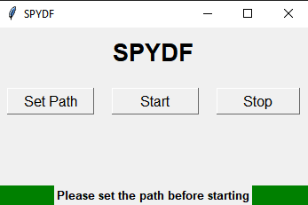
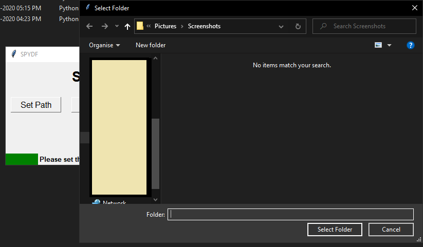
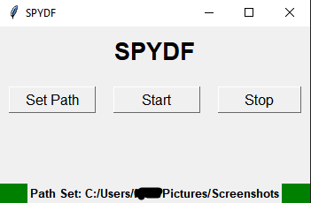
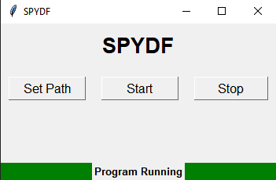

# spydf
## Automatically convert your screenshots into PDF using Python!

### Description
Habbit of taking numerous screenshots while doing something and never opening them again? Well yeah, screenshots folder is hell of a mess.

Presenting **SPYDF**,
a python program which will automatically create a pdf of your captured screenshots so you don't have to manage them again and again.

I have created **two versions** of this Program
* Spydf
* Spydf_cli
_(pretty self explanatory, right?)_

### Pre-Requisite

This python script depends upon **two libraries** to function.
1. watchdog (*install: pip install watchdog*)
2. pillow (*install: pip install pillow*)

### Instructions to use

1. Clone this repo
2. Go to spydf folder (**important**: all files are necessary for the program to run)
3. Either run **spydf.pyw** normally or **spydf_cli.py** through interpreter.
4. On first run, program will ask for the path to screenshots folder of your OS (*you know it, right?*)

#### GUI Screens

1. **First Run**: Set the path to screenshots folder

   
   
2. **Yeah browse it**:

      

3. **Path successfully set! You're good to go**:

    
   
4. **Click START and the script will start running**:

      

5. **After taking your screenshots, press stop, program will exit and you will find your PDF in the folder from where SPYDF was executed.**

6. **From next run onwards, you do not need to set the path**

     
   
### Contributions
All types of contributions are WELCOME! Try this script, contribute if this helps you :-)
